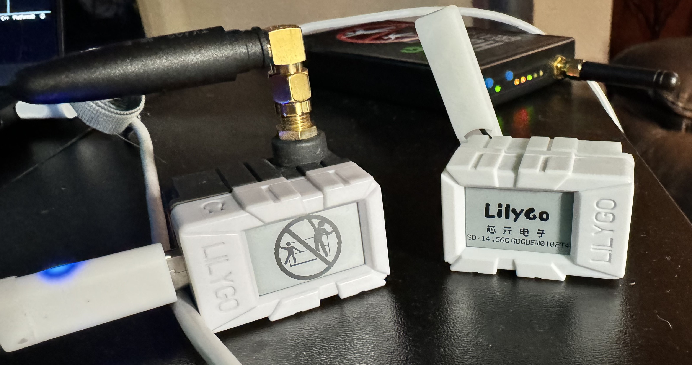

 # taseRFace - Lilygo ePaper Mini Core 1.02 + CC1101 (and other) modules

Tiny ESP32 with ePaper Display, SDCard, and (perhaps most interestingly) a CC1101 Transciever / IR transciever backpack. This project 
uses a fork of the Elechouse-CC1101 drivers, to account for the radio being on the secondary SPI bus of the epaper mini.

More information can be found in the [wiki](https://github.com/thesavant42/lilb42/wiki). 
